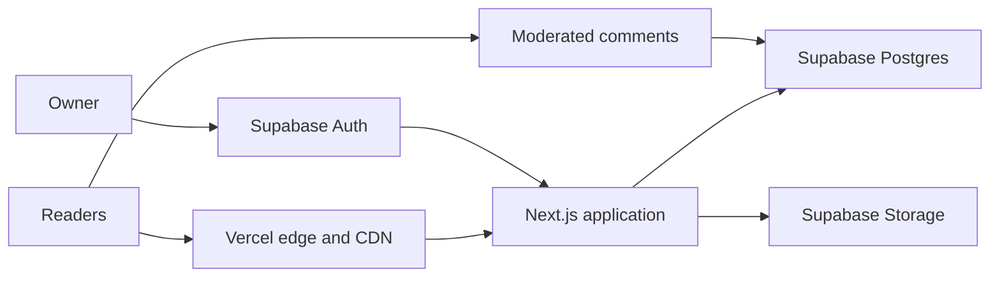

# blog.okdere

A modern editorial platform built to replace a long-running Blogger publication without breaking its history, URLs, or search presence.

**Live:** [blog.okdere.com](https://blog.okdere.com)

## What this project delivers

- A fast, responsive reading experience for essays, reviews, travel writing, and long-form posts
- A private editorial workspace for drafting, previewing, revising, publishing, and media management
- Moderated public comments with author replies
- Shareable 1080 × 1920 story cards generated from each article and its cover image
- Exact preservation of 69 historical Blogger URLs and their canonical addresses
- Archive, category, tag, sitemap, robots, and Atom feed support
- Production analytics and Search Console continuity

## Screenshots

| Desktop homepage | Article view |
| --- | --- |
|  |  |

### Mobile

## Technology

- Next.js App Router and React
- TypeScript
- Supabase Postgres, Auth, and Storage
- Vercel hosting and edge delivery
- Server-rendered metadata, canonical URLs, sitemap, robots, and Atom feed
- Google Analytics 4 and Google Search Console

## Architecture

The public site, private editorial workflow, authentication, data, and media layers are separated by clear authorization boundaries. This repository intentionally contains only the public project overview and screenshots—not the production application, database migrations, environment configuration, content export, or administrative implementation.

More detail: [Architecture overview](docs/architecture.md)

## Blogger migration highlights

- Preserved all 69 published legacy paths exactly
- Retained original publication dates, rich article structure, links, images, headings, and embeds
- Kept 25 imported drafts private
- Migrated the two historical comments while preserving the public baseline
- Maintained a reversible cutover path and retained the Blogger export for rollback

## SEO highlights

- Exact production canonicals on historical article URLs
- Production sitemap, robots policy, and Atom feed
- Archive, category, and tag discovery pages
- Structured metadata and social sharing cards
- Preview environments protected from indexing and analytics
- Post-cutover validation of all 69 historical URLs

## Security highlights

- Cookie-based server-side authentication flow
- Row-level authorization for editorial data
- Storage policies for managed media
- Private draft previews and protected administrative routes
- Sanitized rich content and moderated comments
- Origin validation, rate limiting, and restrictive security headers
- Automated dependency, static analysis, accessibility, and release checks

## Repository scope

This is a public showcase repository. It contains no production source code, secrets, credentials, database schema or migrations, generated content dataset, private environment configuration, or internal administrative code.
