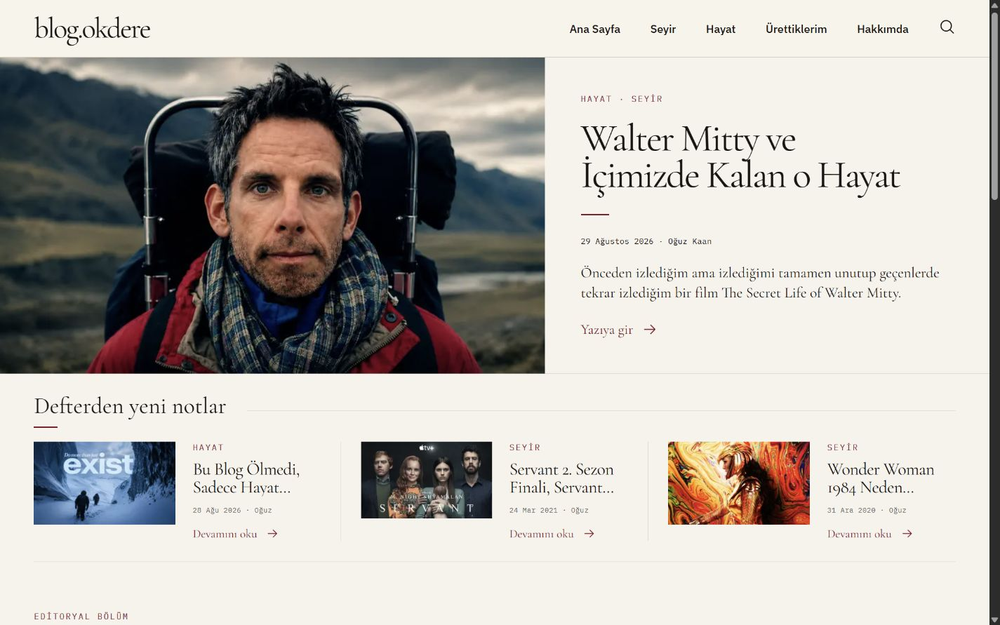
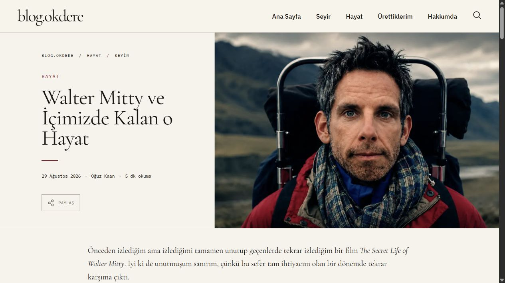
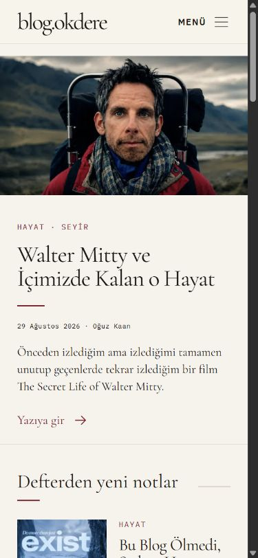
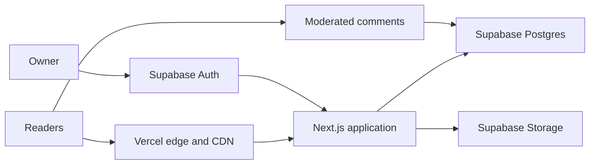

# blog.okdere

A modern personal publishing platform built from scratch to replace a long-running Blogger publication without breaking its history, URLs, or search presence.

**Live:** [blog.okdere.com](https://blog.okdere.com)

## What it is

`blog.okdere` started as a Blogger site in 2015. In 2026, it was rebuilt as a custom publication with a modern reading experience, a private editorial workspace, and room for features that would have been awkward or impossible to build cleanly on the old platform.

The public publication currently combines three main areas:

- **Seyir** — film and series writing
- **Hayat** — personal notes and essays
- **Ürettiklerim** — project journals and build logs

## What the platform delivers

- Fast, responsive reading experience for long-form posts
- Private editorial workspace for drafting, previewing, revising, publishing, and media management
- Moderated public comments with author replies
- First-party read tracking while preserving historical Blogger view counts
- Related reading and return/follow prompts at the end of articles
- Per-post **Character Cards** for quick character reminders, including scene-specific overrides
- Shareable 1080 × 1920 Story images generated from article content and cover art
- Public **Build Log / Ürettiklerim** project journals with isolated update discussions
- Exact preservation of 69 historical Blogger article URLs and their canonical addresses
- Archive, category, tag, sitemap, robots, and Atom feed support
- Google Analytics 4 and Search Console continuity

## Migration highlights

The migration was designed around continuity rather than starting over.

- Preserved all 69 published legacy article paths exactly
- Retained original publication dates, rich article structure, links, images, headings, and embeds
- Kept imported drafts private
- Migrated historical comments
- Carried forward **137,827 historical reads** from Blogger
- Preserved production canonicals and search discovery structure
- Retained the Blogger export as a rollback/fallback source

## Screenshots

| Desktop homepage | Article view |
| --- | --- |
|  |  |

### Mobile

## Technology

- Next.js App Router + React
- TypeScript
- Supabase Postgres, Auth, and Storage
- TipTap-based private authoring
- Vercel hosting and edge delivery
- Server-rendered metadata, canonical URLs, sitemap, robots, and Atom feed
- Google Analytics 4 + Google Search Console

## Architecture

The public site, editorial workflow, authentication, data, and media layers are separated by clear authorization boundaries.

More detail: [Architecture overview](docs/architecture.md)

## Reader experience

The site is intentionally restrained rather than app-like: editorial typography, warm neutral surfaces, responsive navigation, readable long-form layouts, and minimal interface noise.

The goal is simple: a reader should understand where they are, what they are reading, and where to go next without fighting the interface.

## SEO and continuity

- Exact production canonicals on historical article URLs
- Real 404 handling for invalid tag routes
- Indexable editorial/category pages and noindex tag pages where appropriate
- Production sitemap, robots policy, and Atom feed
- Structured metadata and social sharing data
- Preview environments protected from indexing and analytics
- Historical URL validation after cutover

## Security highlights

- Cookie-based server-side authentication
- Row-level authorization for editorial data
- Storage policies for managed media
- Private draft previews and protected administrative routes
- Sanitized rich content and moderated comments
- Origin validation and rate limiting on public write paths
- Restricted security headers and protected preview environments

## Repository scope

This is the **public showcase repository** for the project.

It intentionally contains only high-level documentation, screenshots, and architecture notes. It does **not** contain the production application source, database migrations, secrets, environment configuration, content exports, or private administrative implementation.
